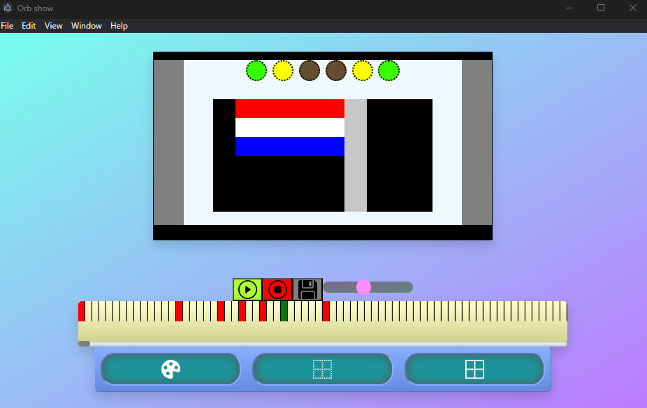
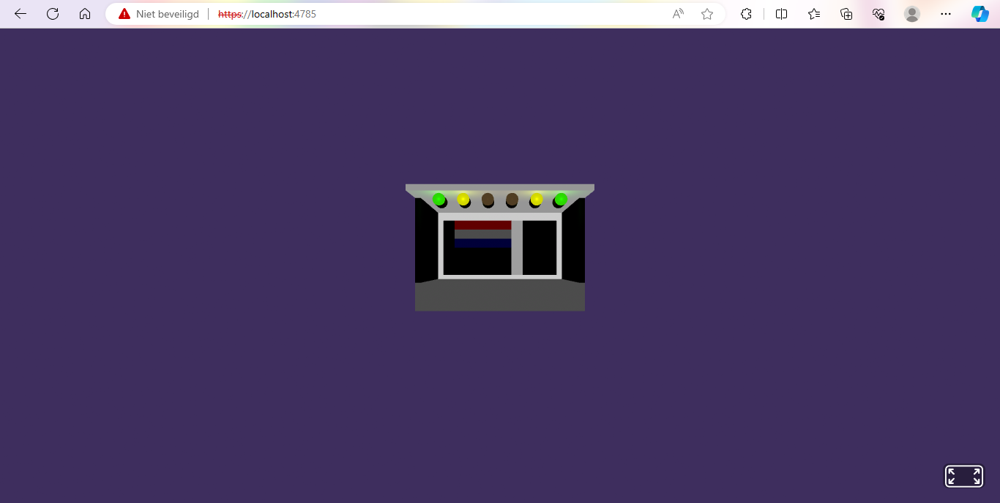

# Orb Show

---

Orb Show is my current senoir project.

The main purpose is:

- Recreate a miniature stage

- Create a graphical user interface for PC that, can be used to program a light show

- Create a simulation in VR with WebXR and A-frame from Mozilla

---

What I have reached so far:

    <ul>
        <li>
            <h6>Orb Show for PC</h6>
            
        </li>
        <li>
            <h6>Orb Show for PC - VR mode</h6>
            
        </li>
    </ul>

